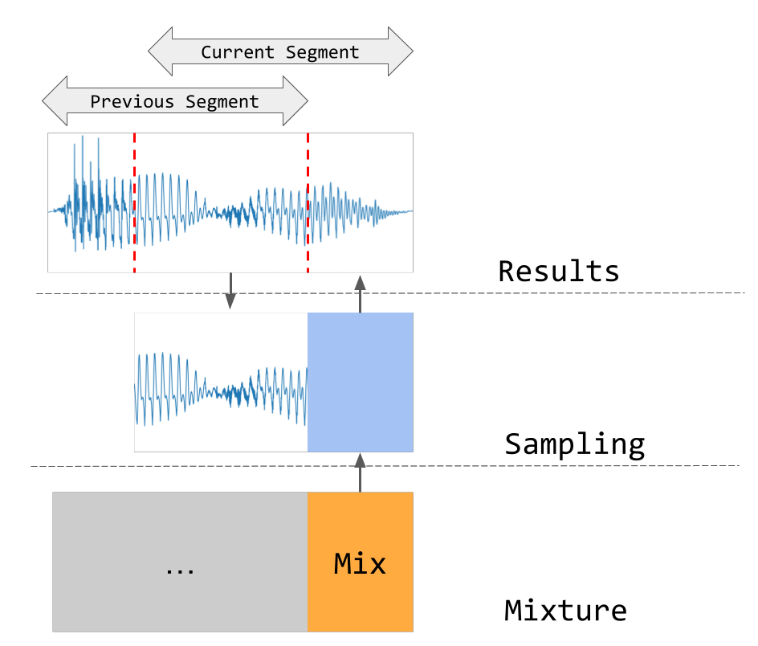

# Abstract

In recent studies, diffusion models have shown promise as priors for solving audio inverse problems [@moliner2023solving; @saito2023unsupervised; @yu2023conditioning; @murata2023gibbsddrm], including source separation [@mariani2023multi]. 
These models allow us to sample from the posterior distribution of a target signal given an observed signal by manipulating the diffusion process.
However, when separating audio sources of the same type, such as duet singing voices, the prior learned by the diffusion process may not be sufficient to maintain the consistency of the source identity in the separated audio.
For example, the singer may change from one to another from time to time.
Tackling this problem will be useful for separating sources in a choir, or a mixture of multiple instruments with similar timbre, without acquiring large amounts of paired data.
In this paper, we examine this problem in the context of duet singing voices separation, and propose a method to enforce the coherency of singer identity by splitting the mixture into overlapping segments and performing posterior sampling in an auto-regressive manner, conditioning on the previous segment.
We evaluate the proposed method on the MedleyVox dataset [@medleyvox] with different overlap ratios, and show that the proposed method outperforms naive posterior sampling baseline.
Our source code and the pre-trained model are publicly available on https://github.com/yoyololicon/duet-svs-diffusion.

# Introduction

With the success of audio generative models, such as OpenAI's Jukebox [@jukebox], works have been conducted to leverage them in unsupervised source separation [@manilow2021unsupervised; @zai2022transfer].
The benefit of this approach is that the training is done on isolated sources and does not require paired multi-track data, which is sometimes difficult to obtain.
Moreover, the rise of diffusion models (DMs) [@ddpm; @song2020score] introduce a more flexible way for unsupervised source separation compared to the traditional generative models.

By adding conditional information into the diffusion process, we can sample the target signal from a pre-trained unconditional DM given an observed signal.
This process is called posterior sampling, and has been applied successfully in solving various audio inverse problems [@moliner2023solving; @saito2023unsupervised; @yu2023conditioning; @murata2023gibbsddrm; @vrdmg] and also source separation[@mariani2023multi; @hirano2023diffusion].
@mariani2023multi trained a 4-track DM, each track correponds to $Bass$, $Drums$, $Guitar$, and $Piano$, and proposed a novel conditioning scheme based on the Dirac delta function to do music source separation with posterior sampling.
@hirano2023diffusion proposed to use an unconditional speech DM to enhance an initial estimation of a multi-speaker speech separation model.
They assume the target speech is drawn from a Gaussian distribution centered at the initial estimation and use Diffusion Denoising Restoration Models [@ddrm] for refining the estimation.
Nevertheless, no similar work has proposed for source separation of monotimbral sources, such as singing voices, solely based on a single unconditional DM.

We start examining this problem on singing voices separation with an unconditional single singer DM and found that, without additional guidance similar to @hirano2023diffusion, the singer identity in the separated audio is not consistent and can switch from one to another after a short period of time.
This is reasonable because the prior we can use are the implicit timbre conherency and the pitch contour distribution learned by the DMs.
Moreover, in case the sources in the mixture are sung by the same singer, which is common in studio recordings, only the pitch prior can be utilised.
Interestingly, this kind of failure cases also exist in supervised separator [@medleyvox], showing that the problem is not trivial.

In this paper, we propose to tackle this problem by splitting the mixture into overlapping segments and perform posterior sampling sequentially.
The mixture of the segment and the overlapping part of the previous segment are used as condition.
We hypothesise that conditioning on the previous segment can guide the posterior sampling to maintain the singer identity.
In addition, decomposing the distribution into a chain of conditional distributions also gives users finer control over the separation process, suitable for human-in-the-loop applications.

# Problem Formulation

Let us start with a general formulation of the multi-channel audio inverse problem.
We have an M-channel mixture signal $\mathbf{x}(n, f) \in \mathbb{C}^M$ where $n, f$ are the time and frequency indices, respectively.
It contains $N$ sources $s_i(n, f) \in \mathbb{C}^N$ where $i \in \{1, 2, ..., N\}$, and a measurement noise signal $z \sim \mathcal{CN}(0, \sigma_x^2)$.
The sources are transformed by a non-invertible linear system $\mathbf{H}(n, f) \in \mathbb{C}^{M \times N}$ and mixed with the noise, resulting in
$$
\mathbf{x}(n, f) = \mathbf{H}(n, f)
\begin{bmatrix}
s_1(n, f) \\
s_2(n, f) \\
\vdots \\
s_N(n, f)
\end{bmatrix}
+ z.
\label{mix}
$$
The objective of the inverse problem is to estimate the sources $\mathbf{s}(n, f) \in \mathbb{C}^N$ from the mixture $\mathbf{x}(n, f)$.
To solve this with posterior sampling, we need to train DMs that model the distribution of the sources $p(s_i(n, f))$.
Each $s_i(n, f)$ is either drawn from different or the same distributions (DMs), where the latter is the case we want to tackle in this paper.
Note that by distribution we mean the sounds sharing very similar timbre, such as singing voices or string instruments.

## Related works

The work by @mariani2023multi is one of the pioneer that use posterior sampling to do source separation. 
They consider single channel source separation where $\mathbf{H}(n, f)$ is simply an all-one vector.
However, the authors modelled the joint distribution $p(s_1(n, f), s_2(n, f), \cdots, s_N(n, f))$ with a single DM and utilise the inter-source correlation to do separation. 
The joint-training method also cannot generalise to an arbitrary number of sources.
The work by @hirano2023diffusion is the closest work to ours.
The DM they used is trained on single speaker speech data, but the requirement of a pre-trained speech separation model breaks the fully unsupervised assumption.

Outside source separation, several works have dealt with this problem, either with a known $\mathbf{H}(n, f)$ in the case of bandwidth extension [@moliner2023solving; @yu2023conditioning; @vrdmg] or an unknown one such as removing reverberation from vocals [@murata2023gibbsddrm; @saito2023unsupervised].
Non-linear problems such as de-cliping has also been tackled with DMs [@moliner2023solving; @vrdmg].

Lastly, we point out that, there are no works, to the best of our knowledge, that use this approach to solve problems with multiple sources and multi-channel mixtures.
This problem occurs in ensemble separation, such as choir or orchestra sections, which is often recorded with multiple microphones.
The holy grail of this approach is to have a generalised solution that can be applied on arbitrary transformation $\mathbf{H}(n, f)$ and $N$ with the same set of DMs, and each of the DMs is trained on isolated sources without the need of mixture data.

# Methodology

In diffusion models, the data generation process is governed by an ODE
$$
d\mathbf{s}(t) = \sigma(t) \nabla_{\mathbf{s}(t)} \log p(\mathbf{s}(t)) dt.
\label{ode}
$$
Here, we use $\mathbf{s}(t)$ to represent $s_i(n, f) + z, z \sim N(0, \sigma^2(t))$ for arbitrary $i$.
The $\sigma(t)$ is a increasing function of $t$ and is called the noise schedule.
Because $\mathbf{s}(0) \approx s_i(n, f)$, we can sample them by integrating the ODE from $t=T$ to $t=0$ with $\mathbf{s}(T) \sim N(\mathbf{0}, \sigma^2(T))$.
We can use a neural network $\theta(\mathbf{s}(t); t)$ to estimate the score function $\nabla_{\mathbf{s}(t)} \log p(\mathbf{s}(t))$ by training them to denoise the noisy data $\mathbf{s}(t)$, where $t \sim U(0, T)$.

## Mixture conditioning

One can transform the score function to a conditional one using simple bayes rule
$$
\nabla_{\mathbf{s}(t)} \log p(\mathbf{s}(t)|\mathbf{x}) = \nabla_{\mathbf{s}(t)} \log p(\mathbf{x}|\mathbf{s}(t)) + \nabla_{\mathbf{s}(t)} \log p(\mathbf{s}(t)).
\label{cond}
$$
We consider the case where the mixture is simply a sum of the sources, i.e. $\mathbf{x} = \sum_{i = 1}^N \mathbf{s}_i(0)$.
We choose the weakly-supervised posterior score function from @mariani2023multi as our conditional score function, which is

$$
\nabla_{\mathbf{s}_i(t)} \log p(\mathbf{s}_i(t)|\mathbf{x}) \approx
\nabla_{\mathbf{s}_i(t)} \log p(\mathbf{s}_i(t)) - 
\nabla_{\mathbf{s}_i(t)} \log p(\mathbf{x} - \sum_{i = 2}^N \mathbf{s}_i(t))
\label{cond2}
$$
for $i > 1$ and we set $\mathbf{s}_1(t)$ as the constrained source.

## Enforcing coherency with auto-regressive inpainting

To tackle the problem of singer identity switching, we propose to split the mixture into overlapping segments and perform posterior sampling sequentially.
The mixture of the segment and the overlapping part of the previous separated segment are used as condition.
The conditioning is simply placing the noisy $\mathbf{s}(t)$ condition on the overlapping part during sampling, similar to inpainting [@crash].
This regulates the model to predict more coherent signal to the condition in the non-overlapping part.
The whole sampling process is illustrated in Figure \ref{fig:diagram}.

{width=80%}

# Experiments

## Datasets

We used the following 8 singing voice datasets for training our unconditional DM.
The total duration of the training data is > 104 hours.

- M4Singer [@m4singer]
- OpenCPOP [@opencpop]
- OpenSinger [@opensinger]
- VocalSet [@vocalset]
- JVS-MuSiC [@jvs]
- Children's Song Dataset [@csd]
- NUS Sung and Spoken Lyrics Corpus [@nus]
- PJS [@pjs]

We resampled all the data to 24 kHz and converted them to mono and segmented the data into 131072 samples (5.46 seconds) with half of the samples overlapping.
The test songs are from the duet category of MedleyVox dataset [@medleyvox].
We dropped 13 clips with loud background music or have effects such as reverb and echo[^1], resulting in 103 clips (also resampled to 24 kHz) for evaluation.

[^1]: We dropped clips from the songs _CatMartino_IPromise_, _TleilaxEnsemble_Late_, and _TleilaxEnsemble_MelancholyFlowers_.

## Training/Evaluation details

The score prediction network is a UNet developed by @mousai with 424M parameters.
We recommend readers to go to our code repository for more details on the configurations.
We used AdamW [@adamw] with a learning rate of 0.0001 and a batch size of 32.
We trained it for 1M steps, which is roungly 8 days on a single RTX A5000 GPU.
The evaluation metrics we used are SI-SDR and SDR improvements (SI-SDRi and SDRi) over the mixture.
We calculated the metrics with the `asteroid` [@asteroid] package.
The number of diffusion steps were set to 100 for all the experiments.
The segment size for auto-regressive sampling was the same as the training data, i.e. 131072 samples.
We tested different overlap ratios for sampling.
Generall speaking, the more overlap the better the results, but the sampling time also increases.
We choose 75% overlap as a good trade-off between the performance and the sampling time.

## Baselines

We evaluated the following methods:

- Non-negative Matrix Factorisation (**NMF**): We reproduced the NMF baseline from @schulze2023unsupervised using `torchnmf`[^3].
A modified version of the multi-pitch estimator from @yu2018multi was used to estimate candidate pitches for initialising the activation matrix.
- **Naive**: The whole mixture is used as condition without segmentation and auto-regressive sampling.
We sampled each mixture 3 times and pick the lowest loss one to the ground truth.
- **AR**: The proposed auto-regressive sampling method. We sampled three times for each segment and pick the lowest loss one to the ground truth before move on to the next segment.
- **Segmented**: The mixture is segmented into 131072 * 25% = 32768 samples without overlapping and naive sampling is performed on each segment.

[^3]: https://github.com/yoyololicon/pytorch-NMF .

## Results and discussions

For all the posterior sampling methods, we ran them three times and report the mean and standard deviation of the metrics in the following table.
The first row is the supervised separator scores copied from the MedleyVox paper [@medleyvox].

| Methods             | SI-SDRi          | SDRi            |
|:------              |:----------------:|:---------------:|
| iSRNet [@medleyvox] | 15.10            | 14.20           |
| NMF                 | 5.12             | 5.97            |
| Naive               | 6.61 $\pm$ 0.25  | 7.60 $\pm$ 0.21 |
| Segmented           | 11.14 $\pm$ 0.48 | 11.77 $\pm$ 0.47|
| AR (proposed)       | **11.24** $\pm$ 0.40 | **11.89** $\pm$ 0.34|
| AR w/ TF            | 11.75 $\pm$ 0.38 | 12.34 $\pm$ 0.39|

All the proposed methods outperformed the learning-free NMF baseline.
Both the auto-regressive sampling and the segmented sampling improved the naive sampling baseline.
The reason is because both methods operate on a smaller segment, thus giving finer control to pick the best sample.

Comparing the auto-regressive and segmented sampling, the effect of the extra information does give AR sampling slightly higher scores and less variance.
However, the difference is not significant considering we only performed three runs for calculating the statistics.
To examine whether the condition plays a role in the sampling process, we also performed sampling with teacher forcing, i.e. using the ground truth signal of the overlapping part as condition.
We name this variant as AR w/ TF.
The results in the table show that accurate condition improves around 0.6 dB in both metrics.

# Conclusions

In this paper, we examined the problem of using an unconditional diffusion model to separate monotimbral sources, in the context of duet singing voices separation.
We proposed sequentially sampling on the overlapping mixture segments to enforce the coherency of singer identity in the separated audio.
We evaluated the proposed method on the MedleyVox dataset. 
The results show that, although most of the improvements are because of the finer control of the sampling process, conditioning on the previous segment does improve the separation performance over the naive posterior sampling baseline.

# References